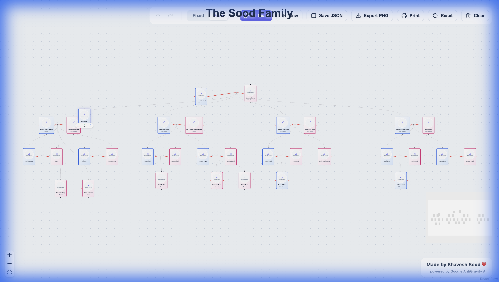

# Family Tree Application

A modern, interactive Family Tree React application powered by React Flow. This workspace allows you to visually build, edit, and manage family connections with a premium UI experience.

## 🚀 How to Run

1.  **Install Dependencies**
    Execute the following command in your terminal to install the required packages:
    ```bash
    npm install
    ```

2.  **Start the Development Server**
    Run the app locally:
    ```bash
    npm run dev
    ```
    The application will be available at `http://localhost:5173`.

## 📖 Application Flow & Features

This application offers a smooth, "infinite canvas" experience for building your family tree.

### 1. Main Tree Interface
The core of the application is an interactive canvas where you can pan, zoom, and drag nodes.
- **Navigation**: Scroll to zoom, click and drag to pan the canvas.
- **Modes**:
    - **Free Mode**: Drag nodes anywhere on the canvas.
    - **Fixed Mode**: Locks nodes in place for a cleaner layout.
- **Toolbar**: Located at the top-right (or bottom on mobile), offering quick access to tools like Undo/Redo, AI Scan, New, Save JSON, Export PNG, and more.


*(Screenshot of the main tree canvas showing several generations)*

### 2. Adding & Managing People
You can easily grow your tree using context-aware actions.
- **Adding Children**: Click the `+ Child` button on any person node. The app automatically handles connections, even properly linking them to existing marriages.
- **Adding Siblings**: Click `+ Sibling` to add a brother or sister next to the selected person.
- **Adding Spouses**: Click `+ Spouse` to create a marriage connection using a custom "Marriage Node" (red line) that visually links partners.


*(Screenshot showing the action buttons on a person node)*

### 3. Editing Profiles
Clicking the "Edit" (pencil) icon on any person opens the **Edit Modal**.
- **Details**: Update Name, Gender, Birth Year, Death Year, and Occupation.
- **Photos**: Upload personal photos that appear directly on the tree node.
- **Delete**: Remove a person and their direct connections.


*(Screenshot of the Edit Person modal)*

### 4. AI Import (Experimental)
The "AI Scan" feature simulates scanning a hand-drawn family tree chart to automatically digitize it.
- **Upload**: Select an image of a chart.
- **Scan**: The app simulates an AI analysis process.
- **Review**: Confirm extracted data before it populates your tree.


*(Screenshot of the AI Import modal)*

### 5. Data Persistence & History
- **Local Storage**: Your tree is automatically saved to your browser's local storage. You can refresh the page and continue where you left off.
- **Undo/Redo**: Mistake? Use the undo/redo buttons in the toolbar to step back and forth through your changes.
- **JSON Export/Import**: Download your tree data as a JSON file for backup or sharing.

## 📂 Project Structure

- **`src/components/TreeCanvas.jsx`**: The main controller. Handles the React Flow instance, state management (nodes, edges, history), and toolbar logic.
- **`src/components/PersonNode.jsx`**: Custom node component rendering the person card (photo, name, details, and action buttons).
- **`src/components/EditModal.jsx`**: Form for editing person details.
- **`src/components/ImportModal.jsx`**: UI for the AI scanning simulation.
- **`src/utils/layout.js`**: (Optional) Logic for auto-layout algorithms if enabled.
- **`src/store/initialData.js`**: Contains the default starting data for the tree.

---

*Made by Bhavesh Sood ❤️ powered by Google AntiGravity AI*
